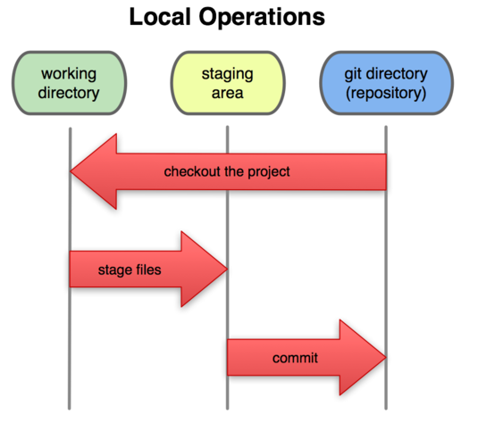

## Git的诞生

在以前有许多版本控制系统，其中有一种叫**集中化版本控制**，这种系统的工作原理是，都有一个单一的集中管理的服务器，保存所有文件的修订版本，所有协同工作的人们都通过客户端连到这台服务器，获取最新文件或者提交更新。但是，这种系统有个弊端，假如服务器宕机，那么在这期间，谁都无法提交更新和协同工作；又或者服务器发生故障面临丢失数据的情况，那么可能会丢失整个项目，因为只能寄托希望在偶然被其中一个客户端提取出来的本地快照数据来恢复了。

这时**分布式版本控制 `Git`**就诞生了。

这种系统中，**`客户端不仅仅是提取最新版本的文本快照，而是把代码仓库完整地镜像下来了`**。这样就算上面集中式的系统会发生的服务器宕机/故障的情况，都可以启用任何一个镜像的仓库进行恢复。

更进一步说明，这种系统还可以指定和若干不同的远端代码仓库进行交互，这样就可以在同一个项目中，分别和不同小组的人互相协助。

Git 和其他版本控制系统的主要差别在于，Git 只关心文件数据的整体是否发生变化，而大多数其他系统则只关心文件内容的具体差异。它并不保存这些前后变化的差异数据。实际上，Git 更像是把变化的文件作快照后，记录在一个微型的文件系统中。每次提交更新时，它会纵览一遍所有文件的指纹信息并对文件作一快照，然后保存一个指向这次快照的索引。为提高性能，若文件没有变化，Git 不会再次保存，而只对上次保存的快照作一链接。（可以说是用哈希值来作索引，不是用文件名。）

**`在 Git 中的绝大多数操作都只需要访问本地文件和资源，不用连网`**。但如果用 CVCS 的话，差不多所有操作都需要连接网络。因为 Git 在本地磁盘上就保存着所有当前项目的历史更新，所以处理起来速度飞快。

举个例子，如果要浏览项目的历史更新摘要，Git 不用跑到外面的服务器上去取数据回来，而直接从本地数据库读取后展示给你看。所以任何时候你都可以马上翻阅，无需等待。如果想要看当前版本的文件和一个月前的版本之间有何差异，Git 会取出一个月前的快照和当前文件作一次差异运算，而不用请求远程服务器来做这件事，或是把老版本的文件拉到本地来作比较。用 CVCS 的话，没有网络或者断开 VPN 你就无法做任何事情。但用 Git 的话，就算你在飞机或者火车上，都可以非常愉快地频繁提交更新，等到了有网络的时候再上传到远程仓库。同样，在回家的路上，不用连接 VPN 你也可以继续工作。换作其他版本控制系统，这么做几乎不可能，抑或非常麻烦。

## Git文件的三种状态
**`已提交（committed），已修改（modified）和已暂存（staged）`**

已提交表示该文件已经被安全地保存在本地数据库中了；已修改表示修改了某个文件，但还没有提交保存；已暂存表示把已修改的文件放在下次提交时要保存的清单中。

由此我们看到 Git 管理项目时，文件流转的三个工作区域：Git 的工作目录，暂存区域，以及本地仓库。

 

 图 1. 工作目录，暂存区域，以及本地仓库
 
几种目录的名词解释：

+ 每个项目都有一个**`Git目录`**（clone下来的是.git目录），它是 Git 用来保存元数据和对象数据库的地方。该目录非常重要，每次克隆镜像仓库的时候，实际拷贝的就是这个目录里面的数据。
 
+ **从项目中取出某个版本的所有文件和目录**，用以开始后续工作的叫做**`工作目录`**。（这些文件实际上都是从 Git 目录中的压缩对象数据库中提取出来的，接下来就可以在工作目录中对这些文件进行编辑。）

+ 所谓的暂存区域只不过是个简单的文件，一般都放在 Git 目录中。有时候人们会把这个文件叫做**`索引文件`**，不过标准说法还是叫**`暂存区域`**。

所以，Git的工作流程可以概括为：
在**工作目录**中修改某些文件 ===> 对修改之后的文件进行快照并保存到**暂存区域** ===> 提交更新，将保存在暂存区域的文件永久转储在**Git目录**。
你可以根据这些流程可以推断出该文件处于什么状态。

## Git配置
这些配置的前提是，你必须已经安装好 Git.

### 基本配置
git config 用来配置或读取相应的工作环境变量，可以存在以下这些地方：

+ /etc/gitconfig文件： 系统中对所有用户都普遍适用的配置。若使用 git config 时用 --system 选项，读写的就是这个文件。
+ ~/.gitconfig文件： 用户目录下的配置文件只适用于该用户。若使用 git config 时用 --global 选项，读写的就是这个文件。
+ 工作目录中的 .git/config 文件：当前项目的 git 目录中的配置文件。这里的配置**仅仅针对当前项目有效**。每一个级别的配置**`都会覆盖上层的相同配置`**，所以 .git/config 里的配置会覆盖 /etc/gitconfig 中的同名变量。

在 Windows 系统上，Git 会找寻用户主目录下的 .gitconfig 文件。主目录即 $HOME 变量指定的目录，一般都是 C:\Documents and Settings\$USER。此外，Git 还会尝试找寻 /etc/gitconfig 文件，只不过看当初 Git 装在什么目录，就以此作为根目录来定位。

检查已有的配置信息：(如果看到重复的变量名，那就说明他们是来自不同的配置文件，但Git只会采用一个。)
```
$ git config --list
$ git config user.name  (直接查阅某个环境变量)
```

### 用户信息

第一个要配置的是你个人的用户名称和电子邮件地址。这两条配置很重要，每次 Git 提交时都会引用这两条信息，说明是谁提交了更新，所以会随更新内容一起被永久纳入历史记录：

```
$ git config --global user.name "John Doe"
$ git config --global user.email johndoe@example.com
```

** 注意：这里使用了 --global，修改的是用户主目录下的配置文件，所有项目都会用到这个配置。如果只需要某个项目用到，去掉 --global 即可。

### 差异分析工具

用于解决合并冲突时使用哪种差异分析工具，比如要用 vimdiff 的话：

```
$ git config --global merge.tool vimdiff
```

Git 可以理解 kdiff3，tkdiff，meld，xxdiff，emerge，vimdiff，gvimdiff，ecmerge，和 opendiff 等合并工具的输出信息。

### 文本编辑器

用于类似于 Linux 的 vi vim 文本编辑器，你也可以自定义一个，比如emacs：

```
$ git config --global core.editor emacs
```

### 帮助
```
$ git help
```

### 查看当前是否还有需要add和提交的文件
```
$ git status
```

### 初始化项目
```
$ git init
```

### 提交项目到仓库
```
$ git commit -m '这是每次提交要写的注释'
```

### 提交到远程仓库
```
$ git push origin master
```

## Git回退版本
### 查看历史记录

显示从最近到最远的显示日志。

```
$ git log
```

### 版本回退操作

可以使用如下2种命令:

第一种是：git reset --hard HEAD^ 那么如果要回退到上上个版本只需把HEAD^ 改成 HEAD^^ 以此类推。

第二种是：那如果要回退到前100个版本的话，使用上面的方法肯定不方便，我们可以使用下面的简便命令操作：

git reset --hard HEAD~100 即可。

文章参考:

+ ① [版本控制发展及Git和Github的使用](http://blog.sina.com.cn/s/blog_5c5c87d80101e4yy.html)
+ ② [Git教程--廖雪峰](http://www.liaoxuefeng.com/wiki/0013739516305929606dd18361248578c67b8067c8c017b000/)
+ ③ [GitHub for Windows呆瓜级操作](http://www.cnblogs.com/foreveryt/p/4228492.html)
+ ④ [Git使用教程--详细教程](http://www.cnblogs.com/tugenhua0707/p/4050072.html)


